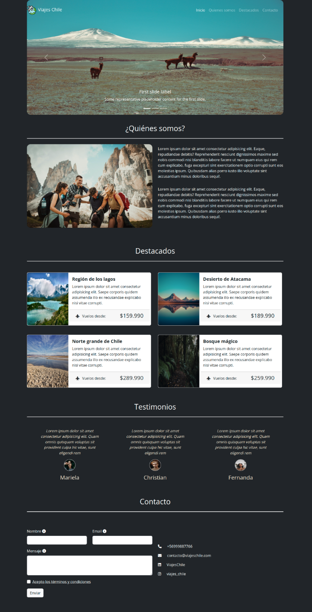

# Prueba final del primer modulo "Fundamentos del desarrollo Front-End"
Para realizar esta prueba debí haber estudiado previamente todo el material
disponible en el LMS correspondiente al módulo 3.

## Descripción
Debo actualizar la pagina web "Viajes Chile" utilizando los conocimientos aprendidos a través de las distintas unidades del módulo
* Una barra de navegación fija en la parte superior de la pantalla que incluye un logo y
los links a las diferentes secciones de la página.
* Un carrusel de Bootstrap que muestra las imágenes destacadas del sitio.
* Una sección de “quienes somos” con información de la agencia (La imagen de esta
sección debe desaparecer en tamaños pequeños de pantalla).
* Una sección de destacados que muestre 4 cards horizontales con los destinos
principales de la agencia. (En pantallas de tamaño pequeño estas cards se modifican
a verticales).
* Una sección con los testimonios de clientes.
* Una sección de formulario de contacto (Incluyendo tooltips y modal en los términos y
condiciones)
* Una sección con los datos de redes sociales de la agencia y números de contacto.
## Maqueta

